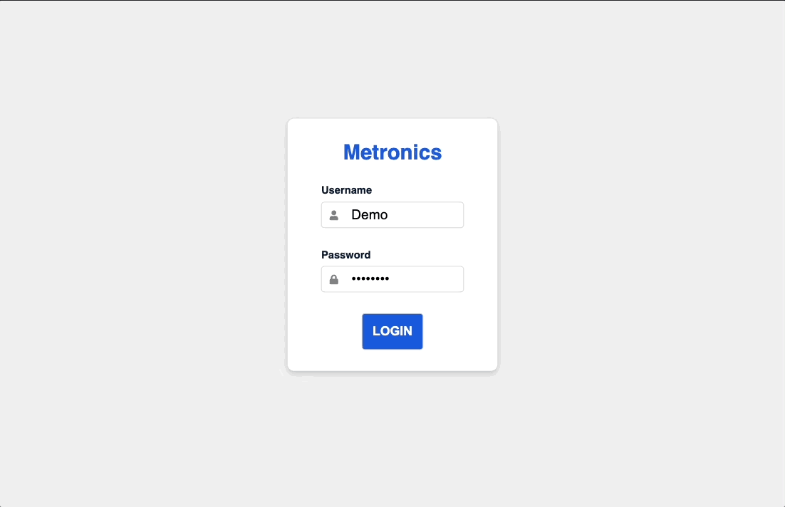

# METRONICS CRM APPLICATION

[//]: # (![Licence]&#40;https://img.shields.io/github/license/profjjk/metronics-crm-webapp&#41;)

---

## PROJECT SUMMARY
A customized tool to digitize the company’s methods for organizing and tracking customers and service requests, and assist with inventory management. Built using the MERN stack (MongoDB, Express.js, React.js, Node.js) with JWT authentication, app-wide state management via React Query, and deployed on AWS.

## TECHNOLOGIES USED
- **FRONT END**
  - [React.js](https://reactjs.org/), [React Query](https://react-query.tanstack.com/), [Day.js](https://day.js.org/en/), [Axios](https://axios-http.com/docs/intro), [Sass](https://sass-lang.com/)
- **BACK END**
  - [Node.js](https://nodejs.org/en/),  [Express.js](https://expressjs.com/), [MongoDB](https://www.mongodb.com/), [Mongoose.js](https://mongoosejs.com/), [bcrypt.js](https://www.npmjs.com/package/bcrypt), [JSON Web Tokens](https://jwt.io/)